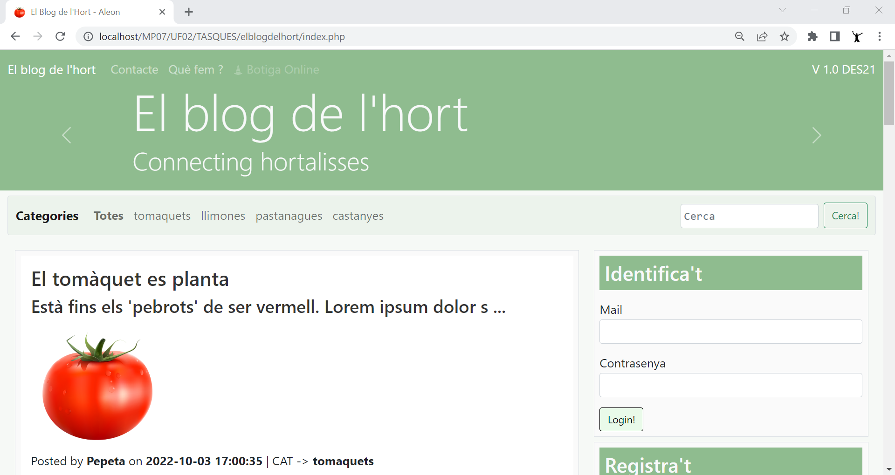
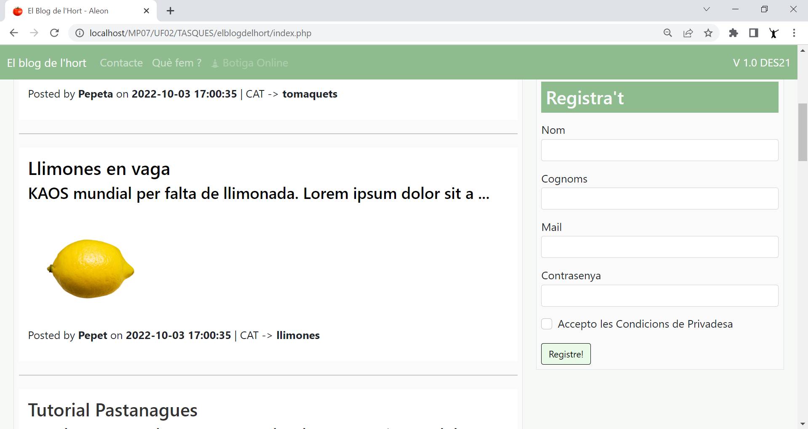
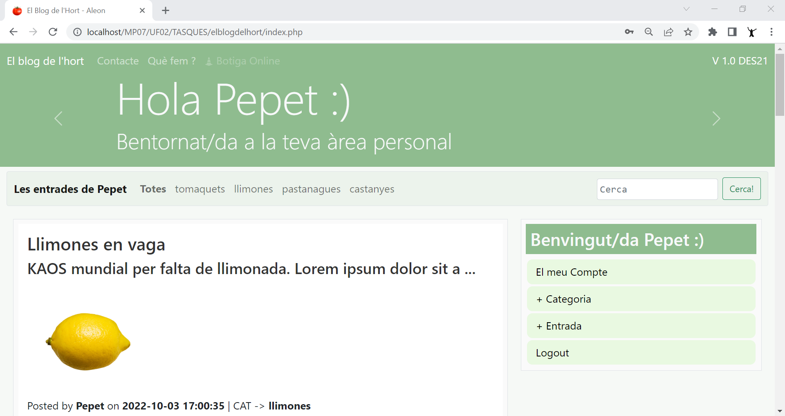

## El Blog de l'Hort
Exemple d'un blog amb PHP natiu amb connexió a MySQL. Ús de sessions, encriptació de contrasenyes, pujada d'arxius, validacions formulari, cercador, includes i maquetació responsive amb Bootstrap

## Requeriments

🖥️ php -v
→ PHP 8.0.12 (cli)

🖥️ MySQL
→ Server version: 8.0.28 MySQL Community Server - GPL

🖥️ Apache
→ Apache/2.4.51 OpenSSL/1.1.1l PHP/8.0.12 Server

or XAMPP

## Get Started

- git clone https://github.com/aleongit/elblogdelhort.git
- load init.sql
- http://localhost/elblogdelhort/index.php or apache site
- user: pepet@gmail.com Blog1234*
- user: pepeta@gmail.com Blog1234*
- or Register

---

---

